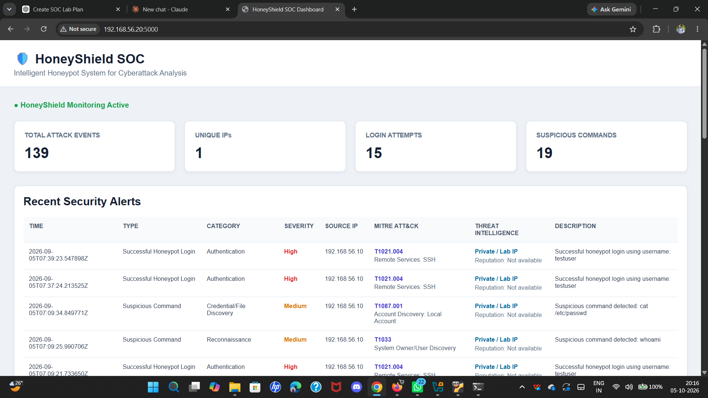
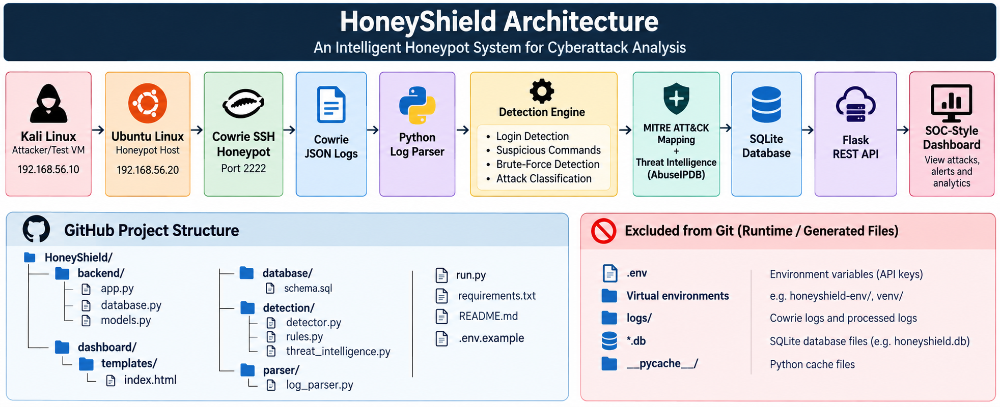

# HoneyShield
## Intelligent Honeypot System for Cyberattack Analysis

HoneyShield is a honeypot-based cybersecurity monitoring system designed to capture, analyze and visualize controlled SSH attack activity in an isolated laboratory environment.

## Dashboard Preview

<p align="center">
  
</p>
## Architecture

<p align="center">
  
</p>

## Main Features

- SSH honeypot using Cowrie
- Controlled attack and session capture
- Login activity detection
- Suspicious command detection
- Attack category classification
- Brute-force detection
- MITRE ATT&CK technique mapping
- Threat Intelligence using AbuseIPDB
- SQLite event and alert storage
- Flask REST API
- SOC-style dashboard
- One-command processing pipeline

## Technologies

- Ubuntu Linux
- Kali Linux
- VirtualBox
- Cowrie
- Python 3
- Flask
- SQLite
- Requests
- python-dotenv
- AbuseIPDB
- MITRE ATT&CK

## Project Structure

```text
HoneyShield/
├── backend/
│   ├── app.py
│   ├── database.py
│   └── models.py
├── dashboard/
│   └── templates/
│       └── index.html
├── database/
│   └── schema.sql
├── detection/
│   ├── detector.py
│   ├── rules.py
│   └── threat_intelligence.py
├── parser/
│   └── log_parser.py
├── assets/
│   └── honeyshield-architecture.png
├── .env.example
├── .gitignore
├── README.md
├── requirements.txt
└── run.py
```

> Runtime databases, raw logs, virtual environments, Python cache files, and .env secrets are intentionally excluded from version control.


## Running HoneyShield

### 1. Start Cowrie

Cowrie runs on the Ubuntu honeypot host and listens on SSH port 2222.

### 2. Activate the environment

source honeyshield-env/bin/activate

### 3. Process honeypot activity

python run.py

This performs:

1. Copy live Cowrie logs
2. Parse JSON events
3. Detect suspicious activity
4. Perform MITRE ATT&CK mapping
5. Perform Threat Intelligence enrichment
6. Update the SQLite database

### 4. Start the dashboard

python backend/app.py

Open:

http://192.168.56.20:5000

## Example MITRE Mappings

whoami
→ T1033 - System Owner/User Discovery

ps
→ T1057 - Process Discovery

cat /etc/passwd
→ T1087.001 - Account Discovery: Local Account

SSH
→ T1021.004 - Remote Services: SSH

Brute Force
→ T1110 - Brute Force

## Threat Intelligence

Private laboratory IP addresses such as 192.168.56.10 are identified as:

Private / Lab IP

Public IP addresses can be enriched using the AbuseIPDB API.

The AbuseIPDB API key is stored in the local .env file and is not included in source code.

## Current Validation

The system has been tested with:

- Successful Cowrie SSH login
- Failed SSH login attempts
- Brute-force detection
- Reconnaissance commands
- Account/file discovery
- MITRE ATT&CK mapping
- Threat Intelligence lookup
- SQLite storage
- Flask API
- SOC dashboard

## Safety

HoneyShield is designed for authorized cybersecurity testing in an isolated laboratory environment.

Do not use the honeypot or attack-testing workflow against systems without authorization.


## Project Workflow

HoneyShield follows this processing pipeline:

```text
Kali Linux → SSH Activity → Ubuntu + Cowrie → JSON Logs → Log Parser → Detection Engine → Attack Classification → MITRE ATT&CK + Threat Intelligence → SQLite → Flask API → SOC Dashboard
```

### Detection

The current implementation uses explainable rule-based detection for SSH login activity, suspicious commands, and possible brute-force behavior.

### Security Analysis

Detected activity is classified into categories such as Authentication, Reconnaissance, Credential/File Discovery, and Command Execution. Observed behaviors are mapped to relevant MITRE ATT&CK techniques.

### Threat Intelligence

Public source IP addresses can be enriched using AbuseIPDB. Private laboratory IP addresses are identified as lab traffic.

### Current Limitations

The current version uses predefined detection rules, batch-oriented processing, a fixed brute-force threshold, and project-level SOC visualization. Machine learning is not part of the current implementation.

### Future Enhancements

Real-time log processing, session-based analysis, advanced risk scoring, additional threat-intelligence sources, historical correlation, and richer SOC analytics can be added in future versions.

### Safety

HoneyShield is intended only for authorized cybersecurity testing in an isolated laboratory environment.
